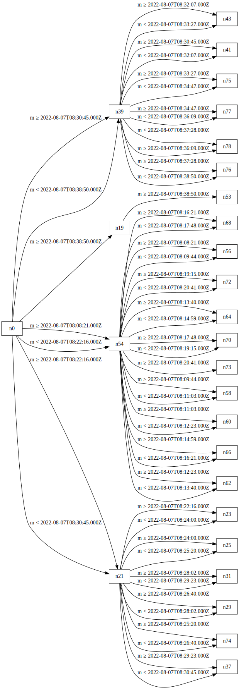
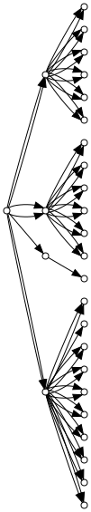

# Tree-document-topology-visualizer

Software to draw the topology of a [TREE collection](https://treecg.github.io/specification/).






## How it work
The processing can be divided into 4 steps;
- Query the TREE view to get the [tree:relation](https://treecg.github.io/specification/#Relation)
- Build a graph from the `tree:relation`
- Build a [graphviz graph](https://graphviz.org/)
- Generate a graph file (supported file types: [`dot`, `svg`, `png`, `jpg`](https://github.com/goccy/go-graphviz))

We use the [Link Traversal Query Processessing modules of the SPARQL query engine Comunica](https://github.com/comunica/comunica-feature-link-traversal)
to execute the following SPARQL query to collect information about the [`tree:Relation`](https://treecg.github.io/specification/#Node)
  and the current [`tree:Node`s](https://treecg.github.io/specification/#Relation).

```sparql
PREFIX tree: <https://w3id.org/tree#>
PREFIX rdf: <http://www.w3.org/1999/02/22-rdf-syntax-ns#>

SELECT ?node ?nextNode ?operator ?value WHERE {
  ?node tree:relation ?relation .
  ?relation tree:node ?nextNode .
  
  ?relation rdf:type ?operator.
  ?relation tree:value ?value .
} LIMIT {limit}
```
We then build a graph from the query response where the vertices are composed of the variables from the SPARQL query `?node` and `?nextNode` and the edges are characterized by the pair (`?node`, `?nextNode`) and are "weighted" with the boolean expression composes with the SPARQL variable `?operator` `?value`.


The graph is forwarded to the [`go-graphviz`](https://github.com/goccy/go-graphviz) library which handles the generation of the graph file.


## Dependencies
- [go version 1.20](https://go.dev/dl/)
- [nodejs v16](https://nodejs.org/en)
- [yarn](https://yarnpkg.com/getting-started/install/)
- [Make](https://www.gnu.org/software/make/) __Optional for building__


## Build


### First use
To build the software for a first time


`make build-all`


It will build the main source code and the `javascript` code used to instantiate Comunica.


### Main source code


To only build the main source code


`make build`


The binary will be located in `./build/tree-visualizer`


### Debugging


To build the code and then run it with the default parameters


`make build-run`


## Usage


To run with the default parameters

`make run`

The binary is located inside the `./build/tree-visualizer`.
To display the help prompt use `-h`.
The file type is inferred from the extension of the path passed to `-p`.


```
Usage of ./build/tree-visualizer:
  -l uint
        The maximum number of relations (default 18446744073709551615)
  -p string
        Resulting path of the graph (default "./generated/graph.svg")
  -t string
        URL of the TREE document (default "http://localhost:3000/ldes/test")
  -u    Make the graph unlabeled
```
## Test
To run all the tests

`make test`

## TO DO


- [ ] Make a streaming version of the program where the graph is generated as the relations are discovered.
- [ ] Make a mode to handle simpler `tree:relation` without using optional statements in the SPARQL query as it really slows down the execution.
- [ ] Include an option to track the nodes that are traversed when executing a SPARQL query from an outsider Query engine.
- [ ] Option to output an `html` file, with an interactive graph using JavaScript.
- [ ] Create a web assembly binary.

## Bib reference

```bib
@software{Tam_tree-document-topology-visualizer_2023,
author = {Tam, Bryan-Elliott},
doi = {10.5281/zenodo.1234},
month = {4},
title = {{tree-document-topology-visualizer}},
url = {https://github.com/constraintAutomaton/tree-document-topology-visualizer},
version = {1.0.0},
year = {2023}
}
```
